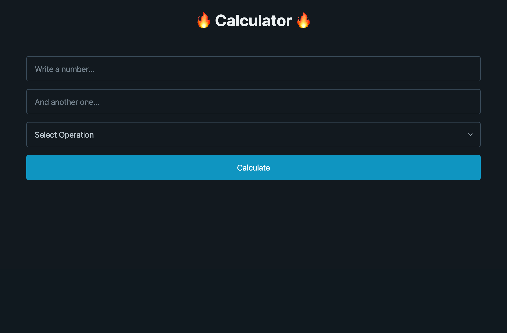
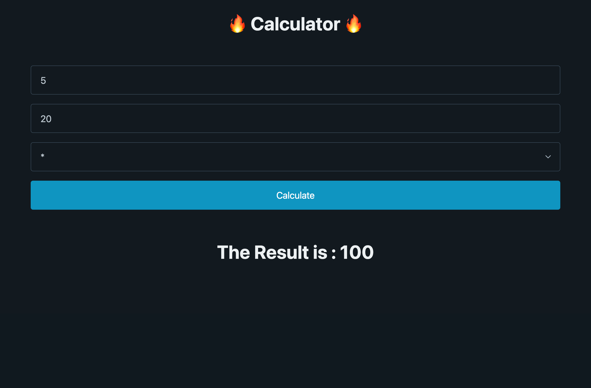

# React로 계산기 만들기

> 목적: state 관리 연습하기

### 배포

[🔗Codesandbox](https://codesandbox.io/p/sandbox/boring-merkle-pjfc7p?file=%2Findex.html)

### 완성 사진

| 
메인
                    | 
계산 결과
               |
| ---------------------------------------- | ---------------------------------------- |
| </img> | </img> |
